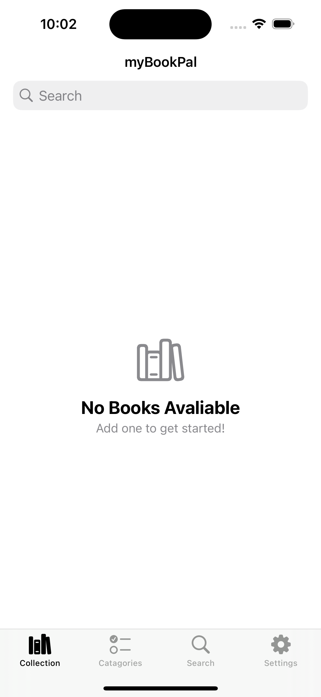
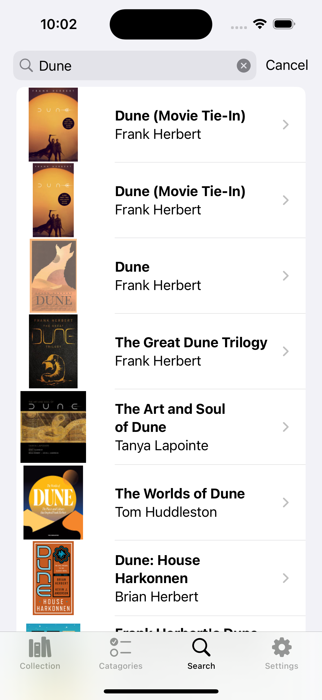
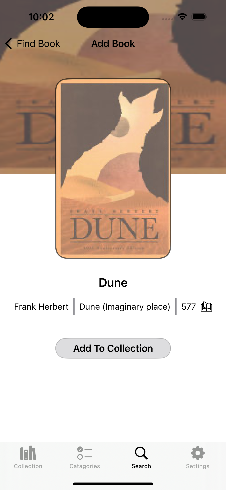
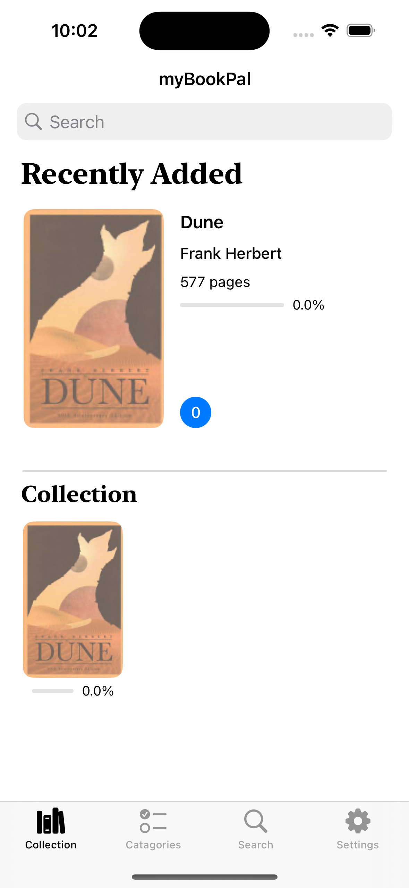
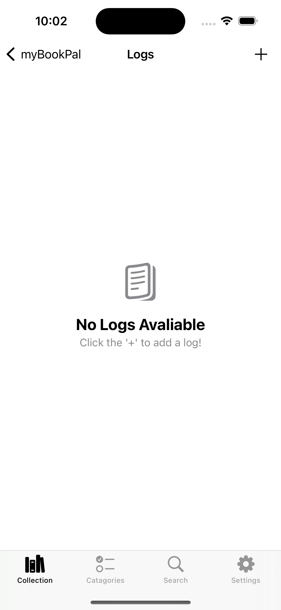
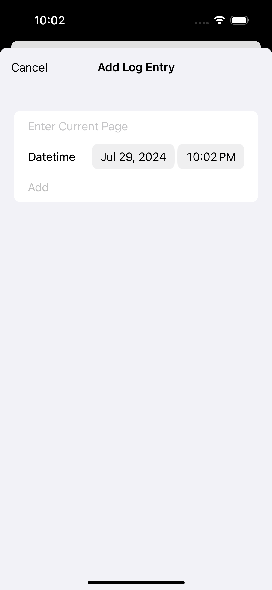

# What is myBookPal?

myBookPal is a minimalistic book tracking application that allows users to search and log books in a simple manner.

# What are the features?

* Collection
    * In the collection, users can either view their most recent book or books that they have already read.
    * Each book will have a completion bar and log counter to show users how many pages were read and the amount of logs that have been inputted.

* Catagories
    * When it comes to catagories, there are two: In Progress, and Completed. 
    * Books that are in progress will be shown in the in progress slider and books that are completed will be shown in the completed slider.

* Search
    * In order to find your book, you must be connected to a secure WiFi connection. 

* Settings
    * In the settings area, users can see the total amount of books read and the current amount of books that are in progress or completed.
    * In addition, users can also delete all books and enable notifications.

# How do I use myBookPal?

* When you first open the app, you will have a empty collection page. To add a book, go to the search tab. Once you are at the search tab, enter your book in the search bar and it will show up. Click on it and add it to your collection.

* Once you have added your book to your collection, go back to the collection tab and you will see your book there. Click on it and add a log to get started!

* Once the log is added, you will see the change in the completion bar and in the logs page.
