# myBookPal

A IOS book logging app that allows users to search books and log of what they read in a day.

## Features

* Collection: All books can be found and searched in the collection tab
* Catagories: Books are categorized by the state of their books status which is either 'In Progress' or 'Completed'
* Search: Books can be searched online using the search tab
* Goals: Users can set monthly and yearly goals based on the amount of books that they want to read
* Settings: If necessary, users also have the ability to delete all books

## How do I log a book?

To log a book, you must search your book by clicking on the search icon in the bottom bar. Here is an example of searching and logging pages for Dune.

    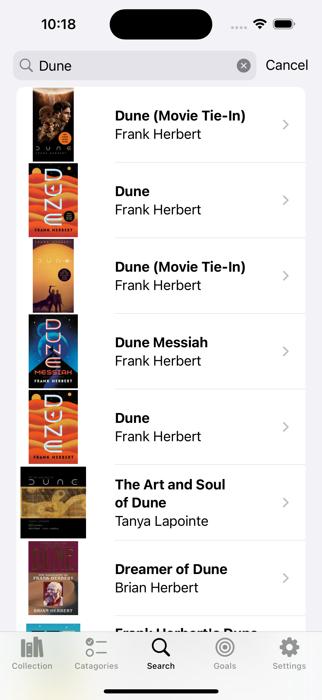
    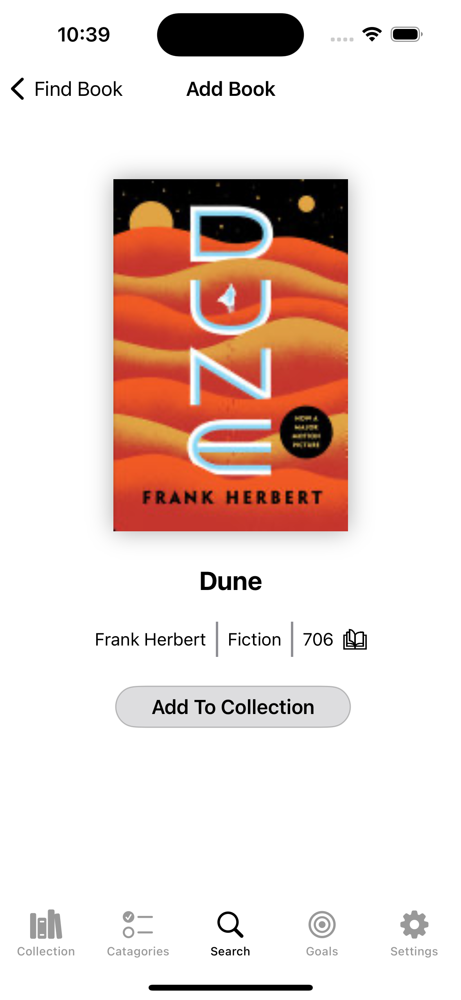
    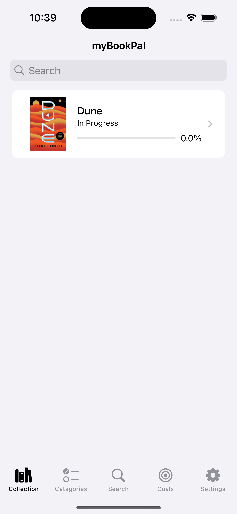
    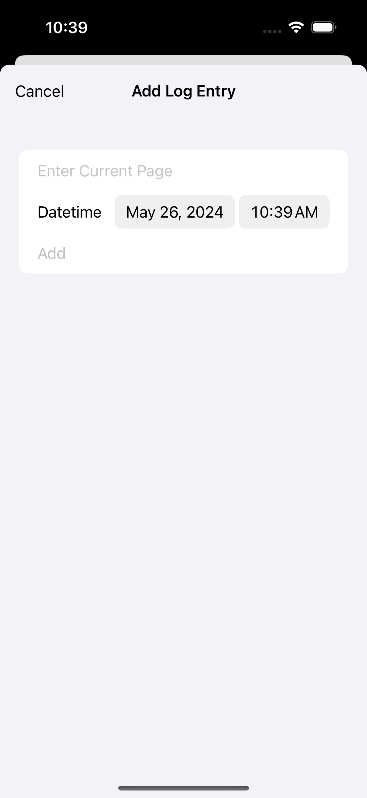

## Collection 

Every book that a user adds will appear in the collection view as well as the category view.

    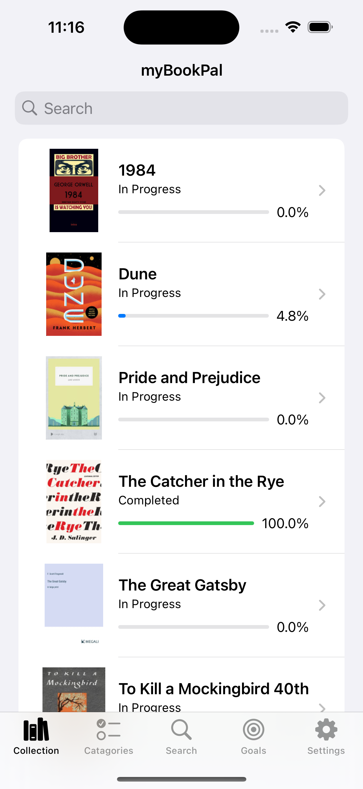
    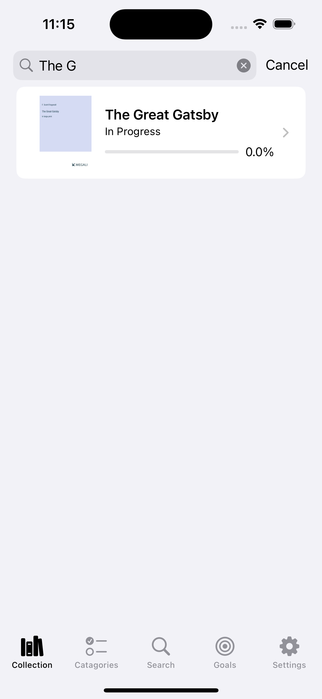

## Categories

Users can see what books are currently in progress or completed by view the catagories tab.

    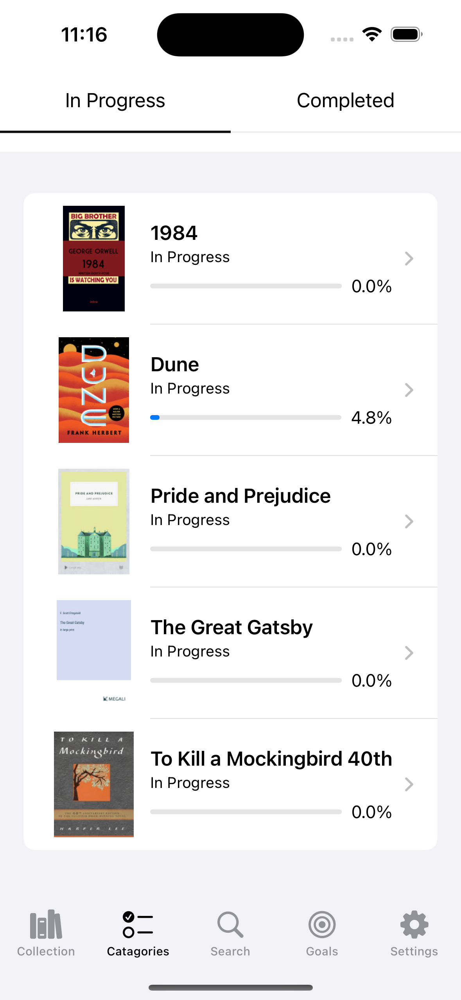
    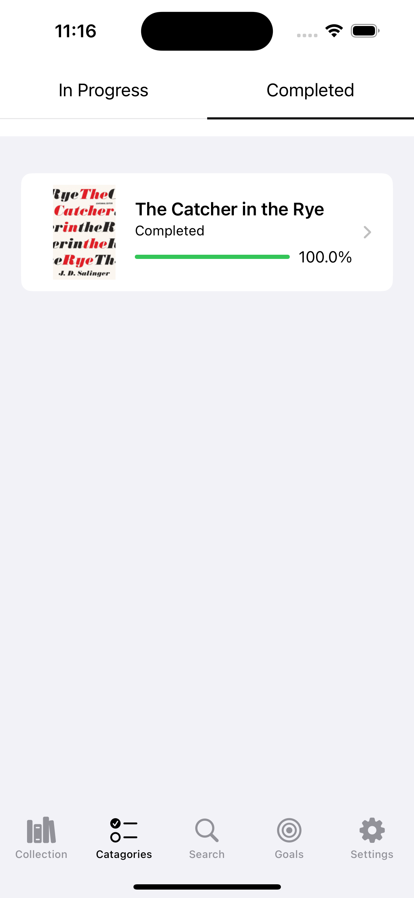

## Search

In order to start logging, users must search their book online using the Google Books API. Some books may or may not have authors or page counts in which users have the option to manually enter that info.

    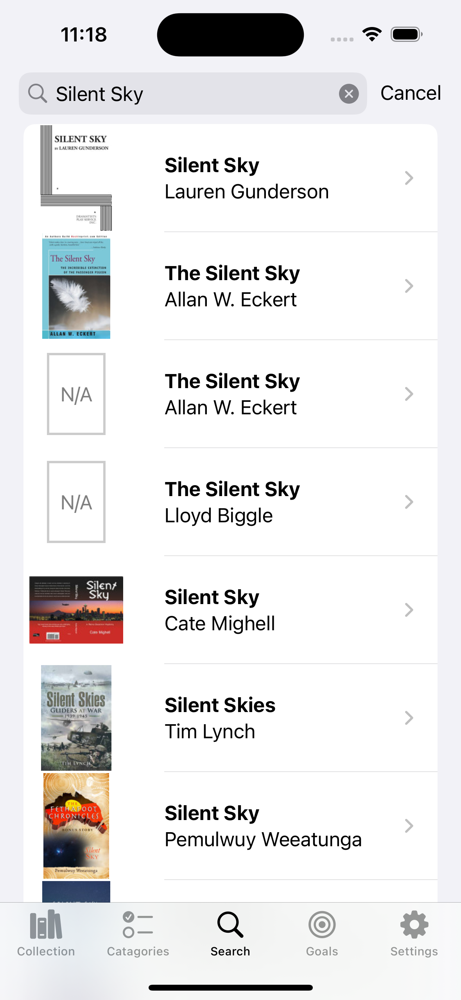

## Goals

To keep users goal oriented, users can set goals based on the amount of books that they want to read monthly and yearly. 

    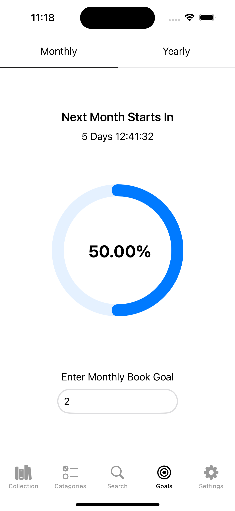
    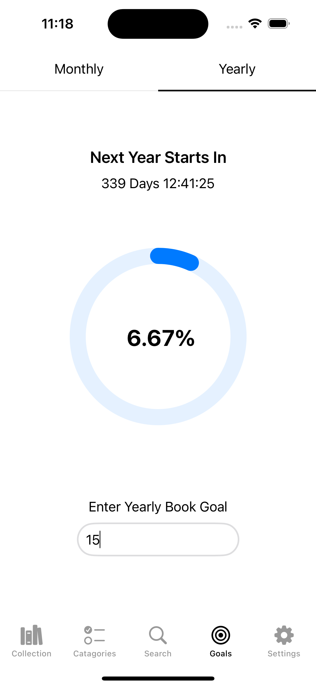

## Settings

Users also have the ability to delete all books if they want to.

    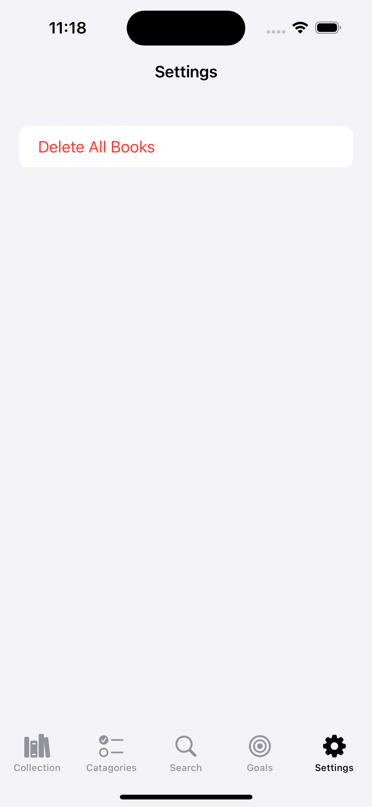

